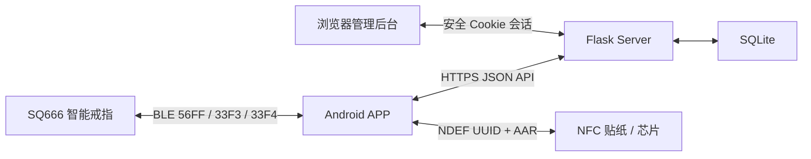

# smartRing / Zikr Ring

smartRing 是一套智能赞念戒指应用，包含原生 Android APP、SQ666 BLE 通信、NFC“祈福”贴纸、Flask API、SQLite 数据存储和浏览器管理后台。

## 项目结构

| 目录 | 说明 |
| --- | --- |
| `client/android` | Android APP，包名 `com.zx.smartring` |
| `server` | Flask API、SQLite 数据模型、管理后台和部署脚本 |
| `bt` | SQ666 BLE 抓包分析及协议说明 |
| `docs/worklog` | 开发工作记录 |



## APP 功能

- 用户注册、登录、注销和本地会话保存。
- 扫描附近可连接的 BLE 设备，通过广播 UUID 或名称识别 SQ666 候选设备。
- 建立 SQ666 GATT 连接，协商 MTU、发现服务、订阅通知并等待首个设备计数。
- 实时接收戒指赞念计数，过滤重复通知并同步到当前账户的云端每日记录。
- 向戒指发送计数重置命令；只有 GATT 写成功且收到设备回显后才确认重置。
- 按月查看当前账户的赞念日历。
- 礼拜信息页面，以及基于定位和方向传感器的城市、经纬度、天房距离和朝向展示。
- 设置诵经时间段和每日系统通知，设备重启后恢复提醒。
- 中英文切换、LTR/RTL 布局切换、息屏时长设置和戒指使用说明。
- NFC“祈福”：写入祝福、扫描展示、失败重试、登录后补传扫描事件，以及“我发起的 / 我收到的”历史列表。
- 前台可使用 NFC Reader Mode；APP 在后台时，匹配 MIME 类型的 NDEF 贴纸可由 Android 拉起祝福展示页。

## Server 功能

- 用户注册、登录令牌、注销和当前账户查询。
- 按账户、按中国标准时间自然日保存赞念数，并支持设备重置后的同步语义。
- 在云端保存祈福贴纸 UUID、发送账户、昵称、祝福语、APP 包名和创建时间。
- 幂等记录每次 NFC 靠近产生的祈福事件，并提供发送/接收历史。
- 提供 Android APK 下载。
- 提供独立管理员账户、12 小时后台会话、CSRF 防护和 HTML 管理页面。
- 管理后台可查看注册用户、用户赞念日历，以及全部祈福发送/接收记录。
- SQLite 持久化；生产环境使用 Gunicorn、systemd 和 Nginx。

生产地址：

- API Base URL：`https://www.panzhenghao.cn/smartRing`
- 管理后台：[https://www.panzhenghao.cn/smartRing/admin/](https://www.panzhenghao.cn/smartRing/admin/)
- 祈福记录：[https://www.panzhenghao.cn/smartRing/admin/blessings](https://www.panzhenghao.cn/smartRing/admin/blessings)
- APK 下载：[https://www.panzhenghao.cn/smartRing/app/sr.apk](https://www.panzhenghao.cn/smartRing/app/sr.apk)

## Server API

### 通用约定

- 以下路径均以 `https://www.panzhenghao.cn/smartRing` 为前缀。
- JSON 使用 UTF-8；有 JSON 请求体时必须发送 `Content-Type: application/json`。
- 需要登录的接口发送 `Authorization: Bearer <token>`。
- APP token 有效期为 30 天；注销后立即失效。
- JSON 请求体最大为 16 KiB。
- 日期 `date` 使用中国标准时间的 `yyyyMMdd`；时间 `createdAt`、`expiresAt` 使用 UTC ISO 8601。
- 服务端出于现有兼容要求使用 MD5 保存密码摘要；客户端应通过 HTTPS 发送原始密码，不应自行计算 MD5。
- JSON 错误统一为：

```json
{
  "code": "ERROR_CODE",
  "message": "错误说明"
}
```

### 接口总览

| 方法 | 路径 | 鉴权 | 说明 |
| --- | --- | --- | --- |
| `POST` | `/regist` | 否 | 注册用户，`/register` 为兼容别名 |
| `POST` | `/login` | 否 | 登录并获取 token |
| `POST` | `/logout` | Bearer | 注销当前 token |
| `GET` | `/me` | Bearer | 获取当前账户 |
| `POST` | `/tasbeeh/reset` | Bearer | 标记下一次赞念同步为重置后同步 |
| `POST` | `/tasbeeh/sync` | Bearer | 同步当天赞念数 |
| `GET` | `/tasbeeh/daily` | Bearer | 获取当前账户每日赞念数 |
| `POST` | `/blessings/tags` | Bearer | 创建云端祝福并生成贴纸 UUID |
| `GET` | `/blessings/tags/{blessingId}` | 否 | 通过贴纸 UUID 获取祝福详情 |
| `POST` | `/blessings/receive` | Bearer | 幂等记录一次收到祈福 |
| `GET` | `/blessings` | Bearer | 获取当前账户发送/接收历史 |
| `GET` | `/app/sr.apk` | 否 | 下载 Android APK |

### 1. 注册用户

`POST /regist`，兼容别名为 `POST /register`。

入参：

```json
{
  "name": "alice",
  "passwd": "secret"
}
```

- `name`：1～64 个字符，首尾不能有空格，区分大小写。
- `passwd`：1～128 个字符。

成功出参（HTTP 201）：

```json
{
  "message": "注册成功"
}
```

用户名已存在时返回 HTTP 409，错误码 `USER_EXISTS`。

### 2. 用户登录

`POST /login`

入参：

```json
{
  "name": "alice",
  "passwd": "secret"
}
```

成功出参（HTTP 200）：

```json
{
  "token": "登录令牌",
  "tokenType": "Bearer",
  "expiresAt": "2026-09-03T08:00:00Z",
  "userId": 1
}
```

用户名或密码错误时返回 HTTP 401，错误码 `LOGIN_FAILED`。

### 3. 用户注销

`POST /logout`

入参：请求头携带 Bearer token，请求体为 `{}`。

成功出参（HTTP 200）：

```json
{
  "message": "注销成功"
}
```

### 4. 获取当前账户

`GET /me`

入参：仅 Bearer token，无请求体。

成功出参（HTTP 200）：

```json
{
  "userId": 1,
  "name": "alice"
}
```

### 5. 标记赞念重置

`POST /tasbeeh/reset`

入参：Bearer token，请求体为 `{}`。

成功出参（HTTP 200）：

```json
{
  "message": "重置状态已设置",
  "reset": true
}
```

该接口不会删除当天记录，只把当前账户的 `tasbeeh_reset_pending` 设为真。下一次 `/tasbeeh/sync` 会把设备上报值累加到当天已有值，随后恢复覆盖同步模式。

### 6. 同步赞念数

`POST /tasbeeh/sync`

入参：

```json
{
  "count": "15"
}
```

`count` 可以是非负整数或只含 ASCII 数字的字符串，最大为 `9007199254740991`。

成功出参（HTTP 200）：

```json
{
  "message": "同步成功",
  "date": "20260804",
  "count": "15",
  "reset": false
}
```

重置状态为真时，服务端返回的 `count` 是“当天已有值 + 本次设备值”；否则本次设备值覆盖当天值。不同账户数据相互独立。

### 7. 获取每日赞念数

`GET /tasbeeh/daily`

入参：仅 Bearer token，无请求体。

成功出参（HTTP 200）：

```json
{
  "all": [
    {
      "date": "20260804",
      "count": "15"
    },
    {
      "date": "20260803",
      "count": "28"
    }
  ]
}
```

结果只包含当前账户，按日期倒序；没有数据时返回 `{"all":[]}`。

### 8. 创建祈福贴纸记录

`POST /blessings/tags`

入参：

```json
{
  "nickname": "小安",
  "message": "愿你平安喜乐",
  "packageName": "com.zx.smartring"
}
```

- `nickname`：1～40 个字符。
- `message`：1～280 个字符。
- `packageName`：1～255 个字符。
- 三个字段首尾均不能有空格。

成功出参（HTTP 201）：

```json
{
  "blessingId": "550e8400-e29b-41d4-a716-446655440000",
  "senderUserId": 1,
  "nickname": "小安",
  "message": "愿你平安喜乐",
  "packageName": "com.zx.smartring",
  "createdAt": "2026-08-04T08:00:00Z"
}
```

APP 只把返回的 `blessingId` 和 Android Application Record 写进 NFC；昵称和祝福语保存在云端。

### 9. 获取贴纸祝福详情

`GET /blessings/tags/{blessingId}`

入参：URL 路径中的 `blessingId`，无需登录、无请求体。

成功出参（HTTP 200）：

```json
{
  "blessingId": "550e8400-e29b-41d4-a716-446655440000",
  "senderUserId": 1,
  "senderName": "alice",
  "nickname": "小安",
  "message": "愿你平安喜乐",
  "packageName": "com.zx.smartring",
  "createdAt": "2026-08-04T08:00:00Z"
}
```

贴纸不存在时返回 HTTP 404，错误码 `BLESSING_NOT_FOUND`。

### 10. 记录收到祈福

`POST /blessings/receive`

入参：

```json
{
  "blessingId": "550e8400-e29b-41d4-a716-446655440000",
  "eventId": "本次物理扫描生成的唯一 UUID"
}
```

`eventId` 最长 64 个字符，是客户端生成的幂等键；同一账户使用同一 `eventId` 重试不会重复创建事件。

成功出参（HTTP 200）：

```json
{
  "duplicate": false,
  "event": {
    "eventId": 12,
    "blessingId": "550e8400-e29b-41d4-a716-446655440000",
    "nickname": "小安",
    "message": "愿你平安喜乐",
    "packageName": "com.zx.smartring",
    "senderUserId": 1,
    "senderName": "alice",
    "recipientUserId": 2,
    "recipientName": "bob",
    "createdAt": "2026-08-04T08:05:00Z",
    "isSelf": false
  }
}
```

重试已有事件时 `duplicate` 为 `true`。发送者和接收者是同一账户时仍保存事件，并返回 `isSelf: true`。

### 11. 获取当前账户祈福历史

`GET /blessings`

入参：仅 Bearer token，无请求体。

成功出参（HTTP 200）：

```json
{
  "sent": [
    {
      "eventId": 12,
      "blessingId": "550e8400-e29b-41d4-a716-446655440000",
      "nickname": "小安",
      "message": "愿你平安喜乐",
      "packageName": "com.zx.smartring",
      "senderUserId": 1,
      "senderName": "alice",
      "recipientUserId": 2,
      "recipientName": "bob",
      "createdAt": "2026-08-04T08:05:00Z",
      "isSelf": false
    }
  ],
  "received": []
}
```

`sent` 和 `received` 最多各 200 条，均按事件时间倒序。同一自祈福事件会同时出现在当前账户的两个数组中。

### 12. 下载 APK

`GET /app/sr.apk`

无入参。成功时返回二进制 APK，`Content-Type` 为 `application/vnd.android.package-archive`，下载文件名为 `sr.apk`。

### 管理后台页面

管理后台返回 HTML，不是 JSON API：

| 方法 | 路径与入参 | 出参 |
| --- | --- | --- |
| `GET` | `/admin/` | 未登录时返回登录页，登录后返回用户列表和总数 |
| `POST` | `/admin/login`，表单字段 `name`、`passwd` | 成功返回 HTTP 303，并设置 Secure、HttpOnly、SameSite=Strict Cookie |
| `GET` | `/admin/user?id=<用户ID>&month=YYYY-MM` | 返回指定用户的月度赞念日历 HTML |
| `GET` | `/admin/blessings?page=<正整数>` | 返回全部祈福事件、双方账户、内容与分页统计 HTML，每页 100 条 |
| `POST` | `/admin/logout`，表单字段 `csrf` | 校验 CSRF 后注销后台会话并返回 HTTP 303 |

后台会话有效期为 12 小时。普通 APP Bearer token 不能用于管理后台。

### 常见 HTTP 状态码

| 状态码 | 含义 |
| --- | --- |
| 200 | 请求成功 |
| 201 | 创建成功 |
| 303 | 管理后台登录/注销后重定向 |
| 400 | JSON 或参数格式错误 |
| 401 | 登录失败，或 token 缺失、无效、过期 |
| 403 | 后台 CSRF 校验失败 |
| 404 | 接口、用户、页码或贴纸不存在 |
| 409 | 用户名重复，或祈福 `eventId` 与已有事件冲突 |
| 413 | 请求体超过 16 KiB |
| 415 | `Content-Type` 错误 |
| 500 | 服务端内部错误 |

更独立的服务端说明见 [`server/README.md`](server/README.md) 和 [`server/API.md`](server/API.md)。

## APP 的 BLE 连接流程与通道

当前 Android 客户端接入 SQ666，不通过 GATT Read 获取赞念数，而是在订阅通知后等待设备主动上报。

### 设备识别

1. Android 12 及以上申请 `BLUETOOTH_SCAN`、`BLUETOOTH_CONNECT`；Android 11 及以下使用旧蓝牙权限并按系统要求申请定位。
2. 以 Low Latency 模式扫描所有可连接设备。
3. 广播包含 `FEF5` Service UUID，或设备名称以 `SQ666` 开头时，标为 SQ666 候选设备。
4. 用户选择设备后立即停止扫描；连接后再用 `56FF/33F3/33F4` 是否齐全作为最终兼容性判断。

### BLE 通道记录

| 通道 | 完整 UUID | 抓包 Handle | 方向与用途 |
| --- | --- | ---: | --- |
| 广播识别 Service | `0000fef5-0000-1000-8000-00805f9b34fb` | — | 扫描阶段识别候选 SQ666 |
| 业务 GATT Service | `000056ff-0000-1000-8000-00805f9b34fb` | `0x0015` | 包含 APP 使用的收发特征 |
| TX Characteristic | `000033f3-0000-1000-8000-00805f9b34fb` | `0x0017` | APP → SQ666，写控制命令，`WRITE_TYPE_DEFAULT` |
| RX Characteristic | `000033f4-0000-1000-8000-00805f9b34fb` | `0x0019` | SQ666 → APP，Notification 上报和命令回显 |
| RX CCCD | `00002902-0000-1000-8000-00805f9b34fb` | `0x001a` | 写 `01 00` 开启 Notification |

Handle 只用于抓包对照，APP 运行时始终按 UUID 查找，不硬编码 Handle。

### 连接状态机


代码状态依次为：

```text
DISCONNECTED
  → CONNECTING
  → MTU_NEGOTIATING
  → DISCOVERING_SERVICES
  → ENABLING_NOTIFICATIONS
  → WAITING_INITIAL_COUNT
  → READY
```

- 连接启动超时为 15 秒；各协议初始化步骤超时为 8 秒。
- 请求 MTU 为 185；最终 MTU 小于 26 时中止连接。
- 必须同时调用 `setCharacteristicNotification(33F4, true)` 并向 CCCD 写 `ENABLE_NOTIFICATION_VALUE`。
- 只有收到首个合法 `0x0033` 计数后才进入 `READY`；只有 `READY` 状态允许重置。

### SQ666 私有帧

所有多字节整数使用 Little Endian：

| Offset | 长度 | 内容 |
| ---: | ---: | --- |
| 0 | 2 | Magic，固定 `FE FC` |
| 2 | 2 | Command，UInt16 LE |
| 4 | 2 | 固定字段，当前 `01 00` |
| 6 | 2 | 固定字段，当前 `01 00` |
| 8 | 2 | Payload Length，UInt16 LE |
| 10 | N | Payload |

当前 APP 处理的命令：

| Command | 方向 | 处理 |
| ---: | --- | --- |
| `0x0033` | SQ666 → APP | `Payload[0..3]` 为设备时间戳，`Payload[6..7]` 为 UInt16 当前赞念数 |
| `0x0038` | APP → SQ666 | 通过 33F3 写入默认任务帧，把 Payload offset 5 的 UInt32 当前计数设为 0 |
| `0x0038` | SQ666 → APP | 通过 33F4 回显；Payload offset 5 的 UInt32 为 0 时确认重置 |

重置写入帧：

```text
FE FC 38 00 01 00 01 00 0D 00
01 01 00 64 00 00 00 00 00 21 00 00 00
```

APP 同时等到 `onCharacteristicWrite(..., GATT_SUCCESS)` 和 `0x0038(count=0)` 回显后才显示成功，重置超时为 3 秒。通知流解析器支持拆包、粘包、Magic 重新同步和重复计数过滤。

完整抓包依据与证据边界见 [`bt/SQ666_APP_BLE_PROTOCOL.md`](bt/SQ666_APP_BLE_PROTOCOL.md)。

## APP 读写 NFC 的格式

### 新版云端 UUID 格式

写卡前，APP 先调用 `POST /blessings/tags` 上传昵称、祝福语和当前 APP 包名。服务端生成标准 UUID，APP 将下面两个 NDEF Record 写入贴纸：

| Record | TNF | Type | Payload 编码与内容 |
| ---: | --- | --- | --- |
| 1 | `TNF_MIME_MEDIA` (`0x02`) | `application/vnd.com.zx.smartring.blessing` | US-ASCII；36 字节标准 UUID，例如 `550e8400-e29b-41d4-a716-446655440000` |
| 2 | `TNF_EXTERNAL_TYPE` (`0x04`) | `android.com:pkg` | UTF-8；当前包名 `com.zx.smartring`，即 Android Application Record（AAR） |

当前字段长度下，完整 NDEF 约为 114 bytes：

```text
Record 1 = 3-byte short-record header + 41-byte MIME type + 36-byte UUID = 80 bytes
Record 2 = 3-byte short-record header + 15-byte AAR type + 16-byte package = 34 bytes
Total    = 114 bytes
```

这种格式不把昵称和祝福语写入贴纸，可适配常见约 144-byte 可用容量的 NTAG213。写入时：

1. 对已有 NDEF 标签使用 `Ndef`，检查 `isWritable` 和 `maxSize` 后调用 `writeNdefMessage`。
2. 对未格式化但支持 NDEF 的标签使用 `NdefFormatable.format(message)`。
3. 不可写、容量不足或不支持 NDEF 时终止并提示用户。

### 读取流程

1. 前台 Reader Mode 通过 `Tag` 读取 NDEF；后台或未启动时由 `NDEF_DISCOVERED` Intent 拉起 `BlessingDisplayActivity`。
2. 遍历 NDEF Record，匹配 TNF `TNF_MIME_MEDIA` 和 MIME type `application/vnd.com.zx.smartring.blessing`。
3. 将 Payload 按 UTF-8/ASCII 解析为 `blessingId`，允许字母、数字、`-`、`_`，最长 64 字符。
4. 调用公开接口 `GET /blessings/tags/{blessingId}` 获取昵称、祝福语和发送者信息并展示动画页面。
5. 每次物理扫描生成新的客户端 `eventId`。用户已登录时调用 `POST /blessings/receive`；离线或未登录时先保存本地待同步记录，后续补传。
6. 自己扫描自己的贴纸不会被过滤，客户端会记录日志，服务端保存 `isSelf: true`。

### 旧版 JSON 兼容

读取器仍兼容早期直接把完整 JSON 放入第一个 MIME Record 的贴纸。短字段格式为：

```json
{
  "v": 1,
  "i": "blessingId",
  "u": 1,
  "n": "昵称",
  "m": "祝福语",
  "p": "com.zx.smartring",
  "t": "2026-08-04T08:00:00Z"
}
```

也兼容 `version`、`blessingId`、`senderUserId`、`nickname`、`message`、`packageName`、`createdAt` 长字段名。新版 APP 只写 UUID 格式，不再创建大容量 JSON 贴纸。

## 本地构建与测试

### Android

当前配置：Android Gradle Plugin `8.9.1`、Gradle `8.11.1`、Kotlin `2.0.21`、`minSdk 28`、`targetSdk 35`、JVM 11。

Windows：

```powershell
cd client/android
.\gradlew.bat testDebugUnitTest assembleDebug
```

Debug APK 输出：`client/android/app/build/outputs/apk/debug/app-debug.apk`。

### Server

```bash
cd server
python3 -m venv .venv
. .venv/bin/activate
pip install -r requirements.txt
python -m unittest discover -s tests -v
python app.py
```

默认监听 `127.0.0.1:8001`。可用环境变量和生产部署方式见 [`server/README.md`](server/README.md)。
